# Easy Cloud HFS

Lightweight Windows HTTP file sharing server inspired by HFS.


[Releases](https://github.com/Terence0816/easy-cloud-hfs/releases)

English | [繁體中文](#繁體中文)

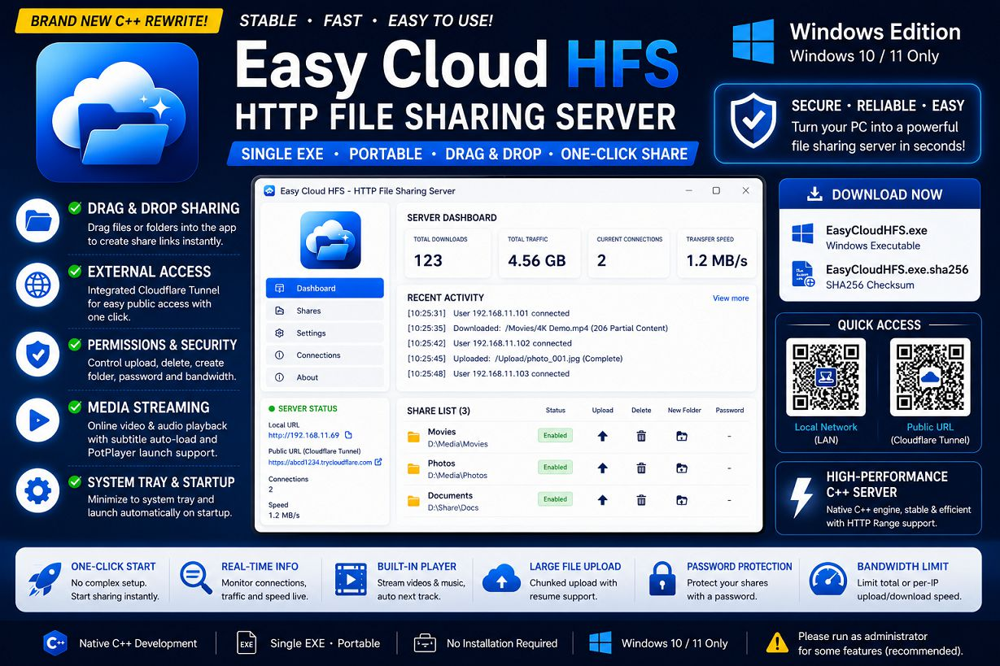

Easy Cloud HFS is a lightweight **Windows HTTP file sharing server**.

It turns your Windows PC into a simple file sharing server, allowing other devices to access shared files through a web browser. It supports local network sharing and can also create a temporary public access URL through Cloudflare Tunnel.

This project is designed as a portable Windows desktop tool with a native C++ / Qt Widgets interface.

> This project is source-available for personal, educational, research, and non-commercial use only.

## Features

* Windows HTTP file sharing server
* Native C++ / Qt Widgets desktop application
* Single EXE portable design
* No installation required
* Local network file sharing
* Optional Cloudflare Tunnel external access
* Automatically generates a temporary `trycloudflare.com` public URL
* Drag-and-drop file and folder sharing
* Share files, folders, and virtual folders
* Upload permission control
* Delete permission control
* Create-folder permission control
* Download password support
* HTTP Range request support for resume and media seeking
* Large-file upload support
* Web-based file manager
* Online video and audio playback
* Subtitle auto-load support
* PotPlayer launch support for Windows clients
* Image preview and slideshow support
* Real-time dashboard
* Server activity log
* Minimize to system tray
* Optional launch on Windows startup
* Traditional Chinese interface
* Designed for Windows 10 / 11

## Main Use Cases

* Share files from a Windows PC to devices on the same LAN
* Use a PC as a lightweight temporary file server
* Share files with friends or customers through a browser
* Transfer files without installing a client program on the receiving device
* Create a temporary external public link with Cloudflare Tunnel
* Stream videos or music directly from the Windows PC
* Use a desktop computer as a portable private cloud disk

## How It Works

1. Start Easy Cloud HFS on your Windows PC.
2. Drag files or folders into the app, or create shares manually.
3. Open the LAN address from another device in a browser.
4. Optional: enable Cloudflare Tunnel to create an external public URL.
5. Use upload, delete, and create-folder permissions depending on your needs.

## Interface Overview

### Dashboard

The dashboard shows basic server status and real-time statistics.

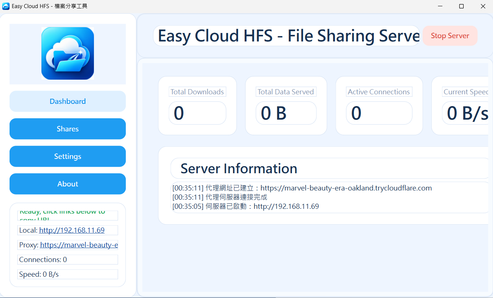

It can display:

* Total download count
* Total transferred data
* Current connection count
* Current transfer speed
* Recent server activity
* LAN address
* Cloudflare Tunnel public URL

### Share Management

The share page allows you to add files, add folders, create virtual folders, and manage existing shared items.

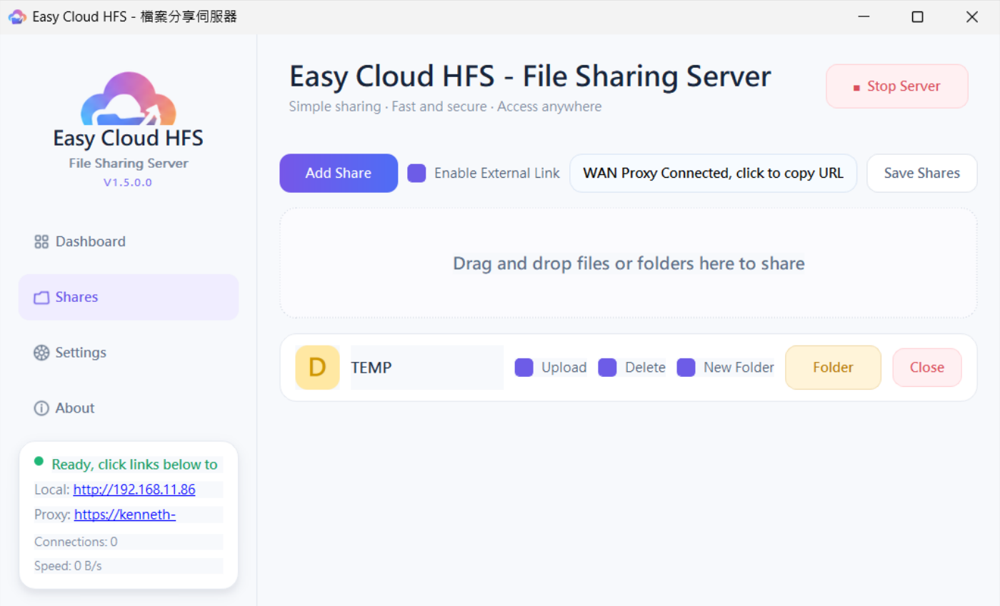

Each shared item can be controlled individually.

Supported permissions include:

* Enable / disable share
* Allow upload
* Allow delete
* Allow create folder
* Password protection

### Settings

The settings page allows you to change server and application behavior.

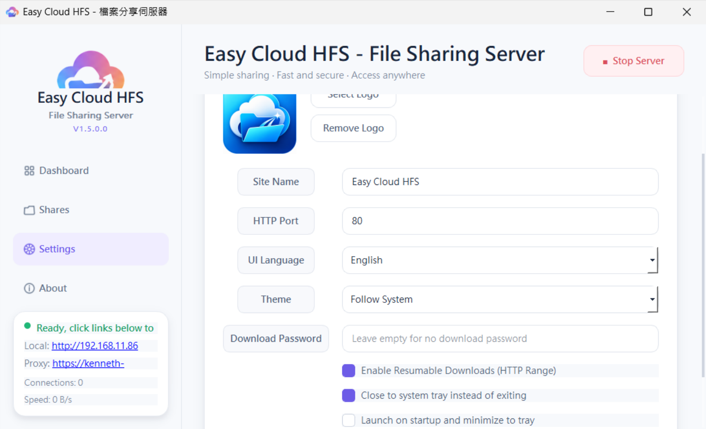

Available settings include:

* Site name
* HTTP port
* Interface language
* Theme mode
* Download password
* HTTP Range / resume support
* Minimize to system tray
* Launch on Windows startup

## Web Interface

Clients can access shared files through a browser.

### Multi-file Selection

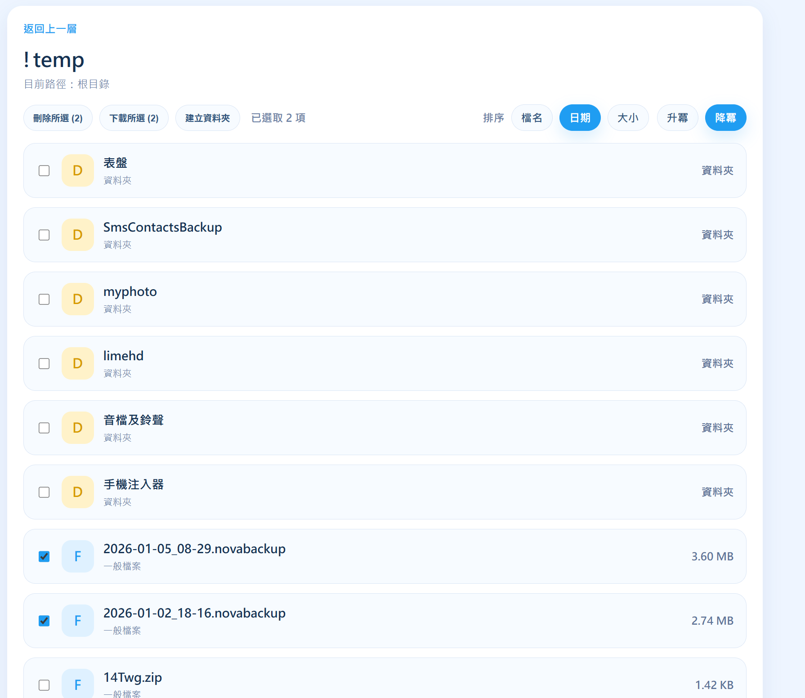

### Image Preview

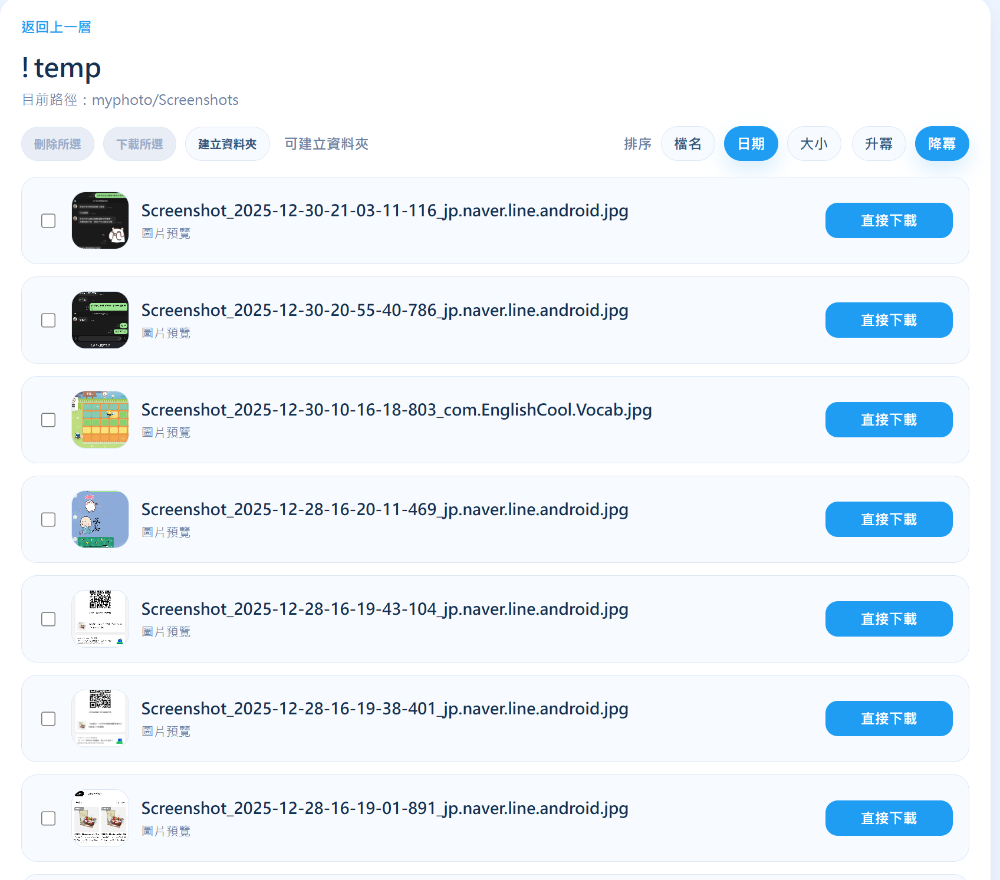

### MP4 / Video Player

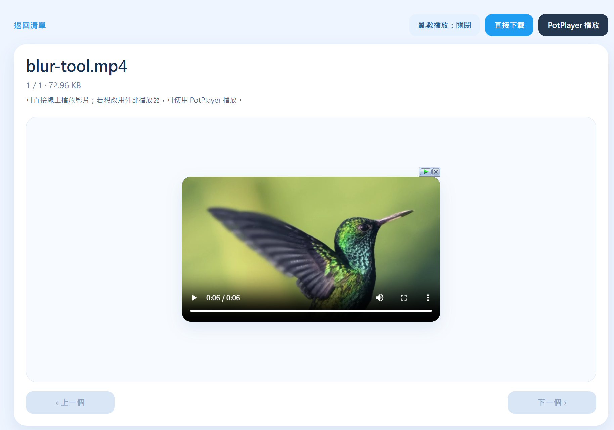

The web interface is designed for simple access, file browsing, file download, media preview, and browser-based upload when permissions are enabled.

## Cloudflare Tunnel

Easy Cloud HFS can use Cloudflare Tunnel to create a temporary public access URL.

This allows external access without:

* Public IP
* Router port forwarding
* DDNS setup
* Firewall changes

When the tunnel is connected, the app shows the generated public URL.

> Cloudflare Tunnel public URLs are temporary and may change after restarting the server or tunnel.

## Media Streaming

The browser interface supports online media playback.

Supported features include:

* HTML5 video playback
* HTML5 audio playback
* Playlist-style browsing
* HTTP Range request support
* Video seeking
* Subtitle auto-load for matching subtitle files
* PotPlayer launch support for Windows clients
* Image preview and slideshow-style browsing

## Permissions and Security

Each shared item can have its own permissions.

You can decide whether users are allowed to:

* Upload files
* Delete files
* Create folders
* Access protected shares with a password

The app also supports a global download password to reduce unauthorized access.

> If you enable external access, please only share the URL with people you trust.

## Portable Files

Easy Cloud HFS is designed to be portable.

Runtime files and settings are stored near the executable when possible.

Common files and folders may include:

```text
EasyCloudHFS.exe
EasyCloudHFS.exe.sha256.txt
easycloudhfs.json
runtime\
virtual\
bin\cloudflared.exe
```

## Download

Download the latest Windows executable from the GitHub Releases page:

[Easy Cloud HFS Releases](https://github.com/Terence0816/easy-cloud-hfs/releases)

Release assets usually include:

```text
EasyCloudHFS.exe
EasyCloudHFS.exe.sha256.txt
```

## SHA-256

```text
34b1cf7d536e9fdf07e6b45749b7ed72b8771068d6996811941585edbd4e5f34  EasyCloudHFS.exe
```

## Notes

* This is the Windows desktop version of Easy Cloud HFS.
* Please download only from the official GitHub Releases page.
* Cloudflare Tunnel public URLs are temporary and may change after restarting the server or tunnel.
* Some features may require running the program as Administrator.
* If Windows Defender SmartScreen or antivirus software shows a warning, this may be because the executable is newly released.
* Please test in your own environment before long-term or public sharing.
* If you enable external access, only share the public URL with people you trust.

## Search Keywords

Windows file sharing server, Windows HFS, HTTP file server, Windows cloud file server, LAN file sharing, Cloudflare Tunnel Windows, trycloudflare file sharing, Windows web file manager, Windows file upload server, Windows media streaming server, PotPlayer streaming, Windows QR file sharing, Windows virtual folder sharing, portable file server, single exe file server

## License

This project is source-available for personal, educational, research, and non-commercial use only.

You may view, study, and modify the source code for personal, educational, research, and internal non-commercial use.

Without written permission from the author, you may not:

* Use this project or its source code in commercial products.
* Use this project or its source code in paid services.
* Sell this software or modified versions.
* Redistribute rebranded versions as your own product.
* Remove or hide the original author information.
* Use the project name, icon, or branding for commercial distribution.

Commercial use requires written permission from the author.

## Disclaimer

This software is provided as-is.

The author does not guarantee full compatibility with every Windows environment, network environment, browser, or media player.

Please use this tool only for files you own or have permission to share.

---

# 繁體中文

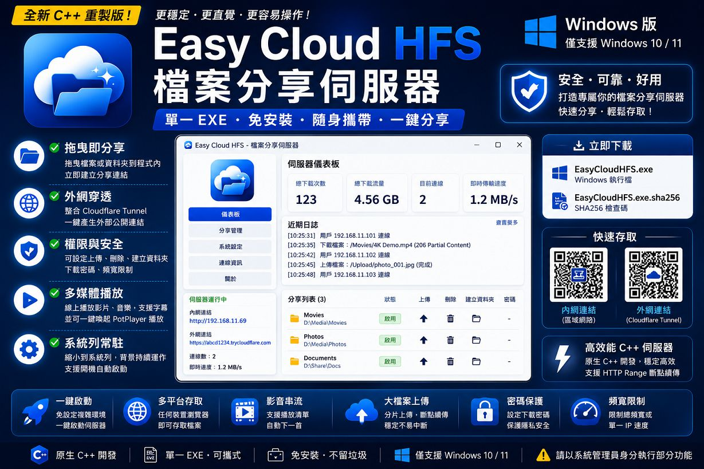

Easy Cloud HFS 是一套輕量化的 **Windows HTTP 檔案分享伺服器**。

它可以將 Windows 電腦變成簡易檔案分享伺服器，讓其他裝置透過瀏覽器存取分享檔案。除了區域網路分享外，也可以透過 Cloudflare Tunnel 建立臨時外部公開連結，方便遠端存取。

本專案設計為原生 C++ / Qt Widgets 的 Windows 桌面工具，重點是簡單、直覺、免安裝與可攜式使用。

> 本專案原始碼僅供個人、學習、研究與非商業用途使用。

## 功能特色

* Windows HTTP 檔案分享伺服器
* 原生 C++ / Qt Widgets 桌面程式
* 單一 EXE 可攜式設計
* 無需安裝，直接執行
* 區域網路檔案分享
* 可選擇啟用 Cloudflare Tunnel 外部連結
* 自動產生臨時 `trycloudflare.com` 公開網址
* 支援拖曳檔案或資料夾快速建立分享
* 支援分享檔案、資料夾與虛擬資料夾
* 可控制是否允許上傳
* 可控制是否允許刪除
* 可控制是否允許建立資料夾
* 支援下載密碼
* 支援 HTTP Range Request，方便續傳與影音拖曳播放
* 支援大檔案上傳
* 內建網頁端檔案管理介面
* 支援線上影片與音樂播放
* 支援字幕自動載入
* 支援 Windows 端 PotPlayer 喚起播放
* 支援圖片預覽與投影片瀏覽
* 即時儀表板
* 伺服器運作記錄
* 可縮小到系統列背景執行
* 可設定開機自動啟動
* 繁體中文介面
* 設計給 Windows 10 / 11 使用

## 適用情境

* 從 Windows 電腦分享檔案給同一個區域網路內的其他裝置
* 將電腦當成臨時小型檔案伺服器
* 透過瀏覽器分享檔案給朋友或客戶
* 接收端不需要安裝任何客戶端程式
* 透過 Cloudflare Tunnel 建立臨時外部公開連結
* 直接從 Windows 電腦串流影片或音樂
* 將桌機或筆電當成輕量化私有雲端硬碟

## 使用方式

1. 在 Windows 電腦上啟動 Easy Cloud HFS。
2. 將檔案或資料夾拖曳到程式內，或手動建立分享。
3. 從其他裝置的瀏覽器開啟區域網路網址。
4. 視需要啟用 Cloudflare Tunnel 建立外部公開網址。
5. 依需求設定上傳、刪除、建立資料夾等權限。

## 介面介紹

### 儀表板

儀表板會顯示基本伺服器狀態與即時統計資料。

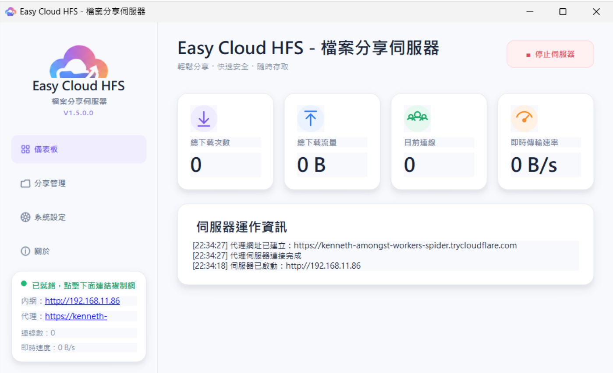

可顯示：

* 總下載次數
* 總下載流量
* 目前連線數
* 即時傳輸速度
* 近期伺服器活動
* 區域網路網址
* Cloudflare Tunnel 外部網址

### 分享管理

分享頁面可新增檔案、新增資料夾、建立虛擬資料夾，並管理目前分享項目。

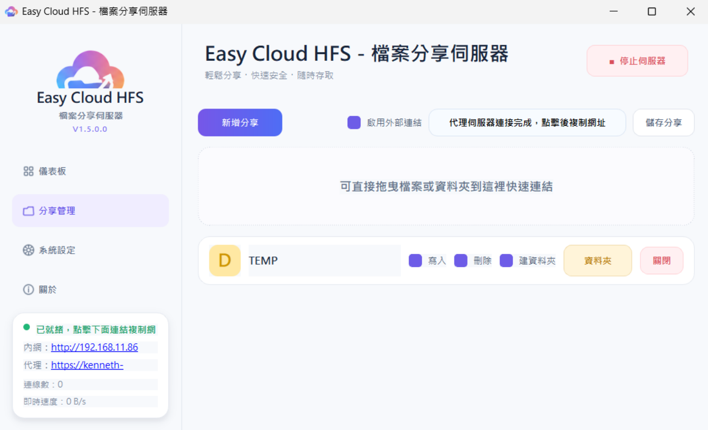

每個分享項目都可以個別控制權限。

支援權限：

* 啟用 / 停用分享
* 允許上傳
* 允許刪除
* 允許建立資料夾
* 密碼保護

### 系統設定

設定頁面可調整伺服器與程式行為。

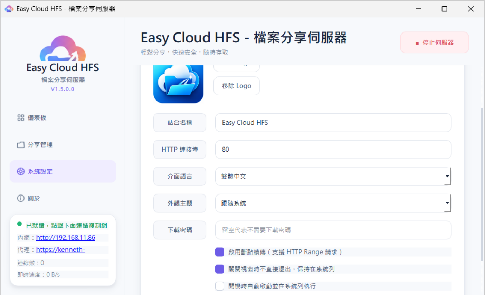

可設定項目包含：

* 站台名稱
* HTTP 連接埠
* 介面語言
* 外觀主題
* 下載密碼
* HTTP Range / 斷點續傳
* 關閉視窗時保留在系統列
* 開機時自動啟動

## 網頁端介面

使用者可透過瀏覽器存取分享檔案。

### 多選檔案


### 圖片預覽


### MP4 / 影片播放器


網頁端介面設計用於快速存取、瀏覽檔案、下載檔案、預覽媒體，以及在權限允許時透過瀏覽器上傳檔案。

## Cloudflare Tunnel 外部連結

Easy Cloud HFS 可透過 Cloudflare Tunnel 建立臨時外部公開網址。

不需要：

* 公網 IP
* 路由器 Port Forwarding
* DDNS 設定
* 防火牆調整

當 Tunnel 連線完成後，App 會顯示產生的公開網址。

> Cloudflare Tunnel 公開網址是臨時網址，重新啟動伺服器或 Tunnel 後可能會變更。

## 影音串流

網頁端支援線上影音播放。

支援功能包含：

* HTML5 影片播放
* HTML5 音訊播放
* 類播放清單瀏覽
* HTTP Range Request
* 影片拖曳播放
* 自動載入同名字幕檔
* Windows 端 PotPlayer 喚起播放
* 圖片預覽與投影片瀏覽

## 權限與安全

每個分享項目都可以個別設定權限。

可自行決定是否允許使用者：

* 上傳檔案
* 刪除檔案
* 建立資料夾
* 透過密碼存取受保護的分享

本 App 也支援全站下載密碼，降低未授權存取風險。

> 若啟用外部連結，請只將網址提供給可信任的對象。

## 可攜式檔案

Easy Cloud HFS 設計為可攜式工具。

執行時的設定與暫存資料會盡可能存放在主程式旁邊。

常見檔案與資料夾可能包含：

```text
EasyCloudHFS.exe
EasyCloudHFS.exe.sha256.txt
easycloudhfs.json
runtime\
virtual\
bin\cloudflared.exe
```

## 下載

請至 GitHub Releases 頁面下載最新 Windows 執行檔：

[Easy Cloud HFS Releases](https://github.com/Terence0816/easy-cloud-hfs/releases)

Release assets 通常包含：

```text
EasyCloudHFS.exe
EasyCloudHFS.exe.sha256.txt
```

## SHA-256

```text
34b1cf7d536e9fdf07e6b45749b7ed72b8771068d6996811941585edbd4e5f34  EasyCloudHFS.exe
```

## 注意事項

* 這是 Easy Cloud HFS 的 Windows 桌面版本。
* 請只從官方 GitHub Releases 頁面下載。
* Cloudflare Tunnel 產生的公開網址為臨時網址，重新啟動伺服器或 Tunnel 後可能會變更。
* 部分功能可能需要使用系統管理員身分執行。
* 若 Windows Defender SmartScreen 或防毒軟體顯示提醒，可能是因為這是新發行的執行檔。
* 建議正式長時間或公開分享前，先在自己的環境測試。
* 若啟用外部連結，請只將公開網址提供給可信任的對象。

## 搜尋關鍵字

Windows 檔案分享伺服器、Windows HFS、HTTP 檔案伺服器、Windows 雲端檔案伺服器、區域網路檔案分享、Cloudflare Tunnel Windows、trycloudflare 檔案分享、Windows 網頁檔案管理、Windows 檔案上傳伺服器、Windows 影音串流伺服器、PotPlayer 串流、Windows QR Code 分享、Windows 虛擬資料夾分享、可攜式檔案伺服器、單一 EXE 檔案伺服器

## 授權

本專案原始碼僅供個人、學習、研究與非商業用途使用。

您可以基於個人、學習、研究與內部非商業用途，檢視、研究與修改本專案原始碼。

未經作者書面同意，不得：

* 用於商業產品。
* 用於付費服務。
* 轉售本軟體或修改版本。
* 改名重新發佈為自己的產品。
* 移除或隱藏原作者資訊。
* 使用本專案名稱、圖示或品牌進行商業散佈。

商業用途需取得作者書面同意。

## 免責聲明

本工具依現況提供。

作者不保證所有 Windows 環境、網路環境、瀏覽器或播放器皆能完整相容。

請僅分享您擁有或被授權分享的檔案。
