# Easy Cloud HFS

Lightweight Windows HTTP file sharing server inspired by HFS.


[Download Latest Release](https://github.com/Terence0816/easy-cloud-hfs/releases/latest) · [All Releases](https://github.com/Terence0816/easy-cloud-hfs/releases)

English | [繁體中文](#繁體中文)

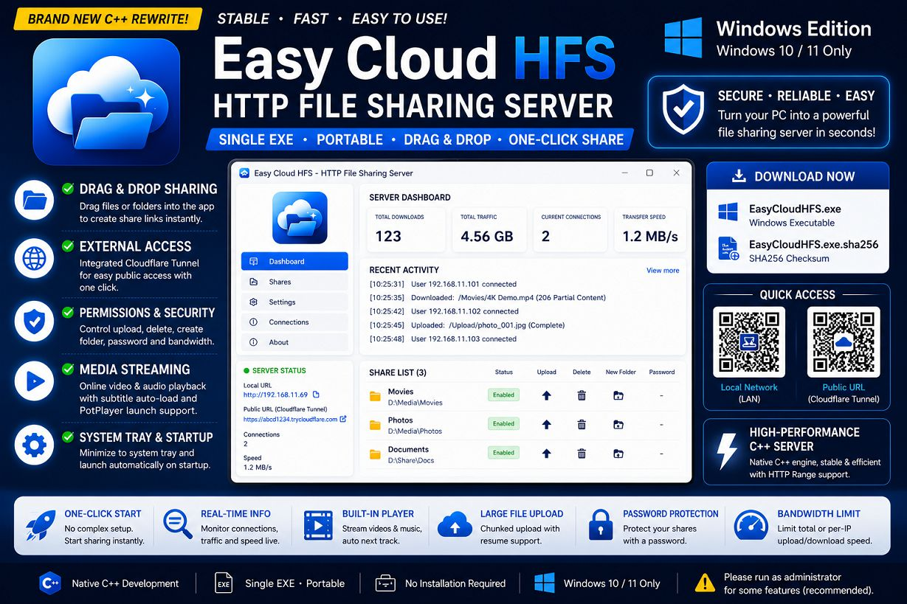

Easy Cloud HFS is a lightweight **Windows HTTP file sharing server**.

It turns a Windows PC into a simple file sharing server, allowing other devices to browse, download, upload, preview, and manage shared files through a web browser. It supports local network sharing and optional external access through Cloudflare Tunnel, including both temporary Quick Tunnel links and permanent domains through Named Tunnel.

The current v2 release is rebuilt as a compact native C++ Windows application with no Qt runtime dependency.

> [!IMPORTANT]
> **Source code status:** Starting with **v2.0.0.0**, the current program source code is no longer published or updated in this repository.  
> The source files currently retained in this repository are provided only as a legacy reference for an earlier version and do **not** correspond to the current v2 release.  
> Current releases are distributed through the GitHub Releases page as compiled Windows executables.

## Latest Release — v2.0.5

Easy Cloud HFS v2.0.5 includes the improvements introduced after v2.0.1, with expanded Cloudflare Tunnel support and new chat notification features.

### v2.0.5 Highlights

#### Cloudflare Quick Tunnel and Named Tunnel

* Added **Named Tunnel** support for using your own permanent Cloudflare domain.
* The original **Quick Tunnel** mode remains fully supported for quickly creating a temporary `trycloudflare.com` public URL.
* Added settings for:
  * External connection mode
  * Permanent public URL
  * Cloudflare Tunnel Token
* Tunnel Tokens are protected with **Windows DPAPI** instead of being stored as plain text.
* The token is supplied to `cloudflared` through the `TUNNEL_TOKEN` environment variable and is not placed in the process command line.
* Named Tunnel mode uses the configured permanent public URL directly instead of generating a temporary shortened URL.

#### Improved Tunnel Settings

* When **Quick Tunnel** is selected, the saved permanent public URL and Tunnel Token are preserved but disabled and shown in a greyed-out state.
* Switching back to **Named Tunnel** immediately restores the related fields.
* Switching modes does not clear the previously saved domain or encrypted Tunnel Token.
* External connection mode changes take effect only after clicking **Save Settings**, helping prevent accidental configuration changes.

#### Chat Notifications

* Added a message-count badge next to **Chat** in the desktop controller.
* Added an unread-message badge to the **Chat** button on web pages.
* Opening the chat page immediately marks the currently available messages as read.
* When another chat tab is already open in the same browser, other file-browsing tabs do not continue accumulating unread messages.
* New messages briefly pulse the Chat button on other tabs while the chat page itself remains distraction-free.
* Read state is synchronized between browser tabs.

### v2.0.1 Chat Improvements

* Added an individual **copy button** to every chat message.
  * Copies only the message content.
  * Visitor name, time, and IP address are not included.
* Improved chat scrolling behavior.
  * Reading older messages no longer gets interrupted by the view automatically jumping back to the bottom when new messages arrive.
  * If the user is already at the bottom, incoming messages still appear automatically.
  * Sending a new message returns the view to the latest message.
* Improved incremental chat message updates for smoother handling of long pasted text and large messages.

## Features

* Lightweight Windows HTTP file sharing server
* Native C++ desktop application
* Compact single-EXE portable design
* No installation required
* No Qt runtime dependency
* Local network file sharing
* Optional Cloudflare Tunnel external access
* **Quick Tunnel** for temporary `trycloudflare.com` public URLs
* **Named Tunnel** support for your own permanent Cloudflare domain
* Windows DPAPI protection for Cloudflare Tunnel Token storage
* Drag-and-drop file and folder sharing
* Share files, folders, and virtual folders
* Rename the displayed name of a shared folder without changing its local path
* Optional browser-based chat for shared pages
* Share-level chat enable / disable control
* Desktop chat message-count badge
* Browser unread-message badge and cross-tab read-state synchronization
* Per-message chat copy button
* Improved chat history scrolling
* Upload permission control
* Delete permission control
* Create-folder permission control
* Password-protected access
* Logout support for password-protected web shares
* HTTP Range request support for resume and media seeking
* Large-file upload support
* Package and download shared folders as ZIP files
* Web-based file manager
* Traditional Chinese and English web interface
* Browser drag-and-drop upload for files and folders
* Multiple-file and multiple-folder upload
* Online video and audio playback
* Music playlist and shuffle playback
* Automatic subtitle loading
* PotPlayer launch support for Windows clients
* Image preview and slideshow support
* Multi-file selection
* Real-time dashboard
* Current file download and packaging progress
* Server activity log
* Minimize to system tray
* Optional launch on Windows startup
* Optional automatic server startup when the application starts
* Automatic version checking and updating
* High-DPI and 2K / 4K display optimization
* Windows 10 / 11 support
* Main application features remain compatible with Windows 7

## Main Use Cases

* Share files from a Windows PC with devices on the same local network
* Use a PC as a lightweight temporary file server
* Share files with friends, customers, or coworkers through a browser
* Transfer files without installing a client program on the receiving device
* Create a temporary external public link through Cloudflare Quick Tunnel
* Use your own permanent public domain through Cloudflare Named Tunnel
* Stream videos or music directly from a Windows PC
* Use a desktop or notebook computer as a lightweight private cloud drive
* Provide optional browser chat while exchanging files

## How It Works

1. Download and start `EasyCloudHFS.exe`.
2. Add files or folders through Share Management.
3. Open the displayed LAN address from another device in a browser.
4. Configure upload, delete, create-folder, chat, and password permissions as needed.
5. Optionally enable Cloudflare external access:
   * Use **Quick Tunnel** for a temporary public URL.
   * Use **Named Tunnel** with a configured Cloudflare Tunnel for your own permanent domain.

## Interface Overview

### Share Management

The program opens directly to Share Management, allowing shared items to be added and managed quickly.

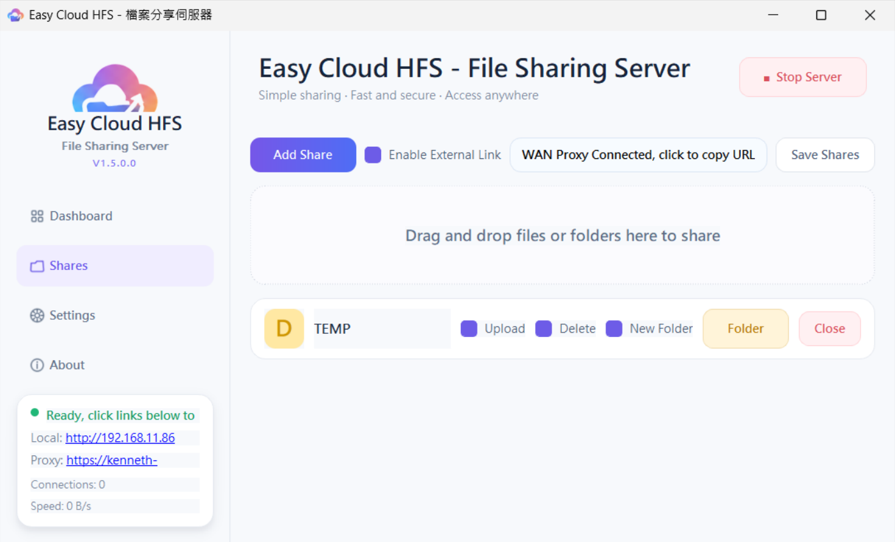

Supported controls include:

* Enable or disable a share
* Change the displayed share name
* Enable or disable browser chat
* Allow upload
* Allow delete
* Allow folder creation
* Configure password protection

### Dashboard

The dashboard shows server status and real-time statistics.

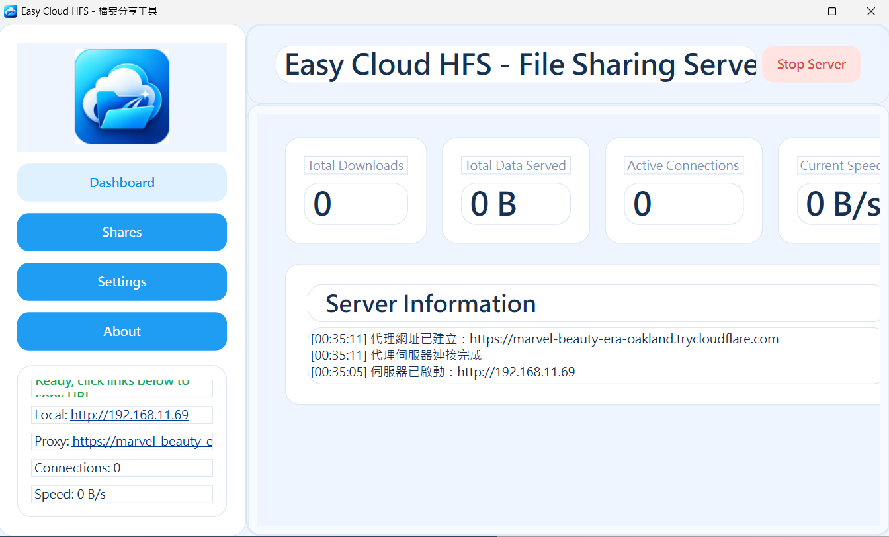

Information may include:

* Total download count
* Total transferred data
* Current connection count
* Current transfer speed
* Current file download and packaging progress
* Recent server activity
* LAN address
* Cloudflare Tunnel public URL

### Settings

The settings page controls server, application, and external-access behavior.

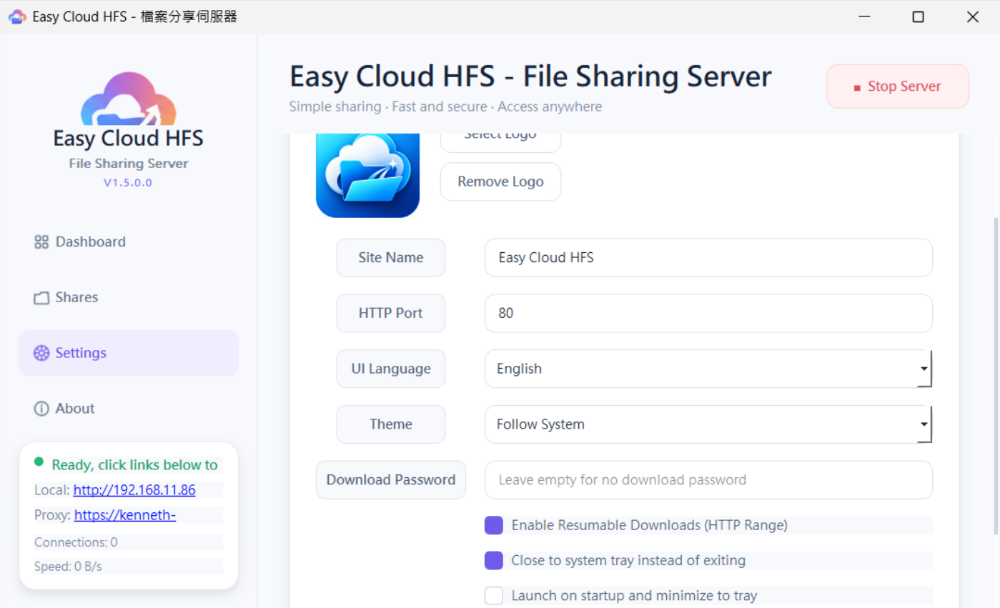

Available settings include:

* Site name
* HTTP port
* Interface language
* Theme mode
* Download password
* HTTP Range / resume support
* Minimize to system tray
* Launch on Windows startup
* Automatically start the server when the application starts
* Cloudflare external connection mode
* Permanent public URL for Named Tunnel
* Cloudflare Tunnel Token

## Web Interface

Clients can access shared files through a standard web browser.

The web interface supports:

* File and folder browsing
* Direct file downloads
* Folder packaging and ZIP download
* File and folder upload when permission is enabled
* Drag-and-drop browser upload
* Multi-file selection
* Traditional Chinese and English language switching
* Optional browser chat
* Chat unread-message notifications
* Per-message copy button
* Image preview
* Music and video playback
* Automatic subtitle loading

### Browser Chat

Shared pages can optionally provide a lightweight browser-based chat room.

Chat improvements in the current release include unread-message indicators, smoother history reading, cross-tab read-state synchronization, and one-click copying of individual messages.

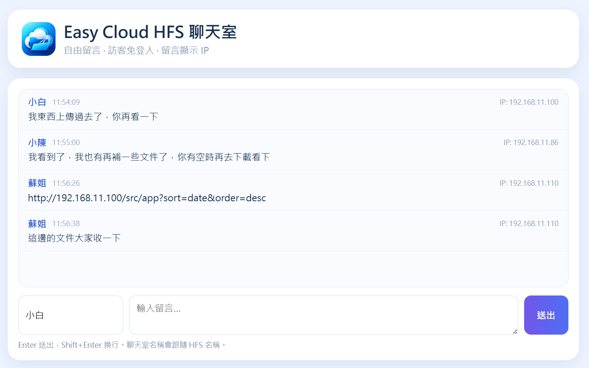

### Multi-file Selection

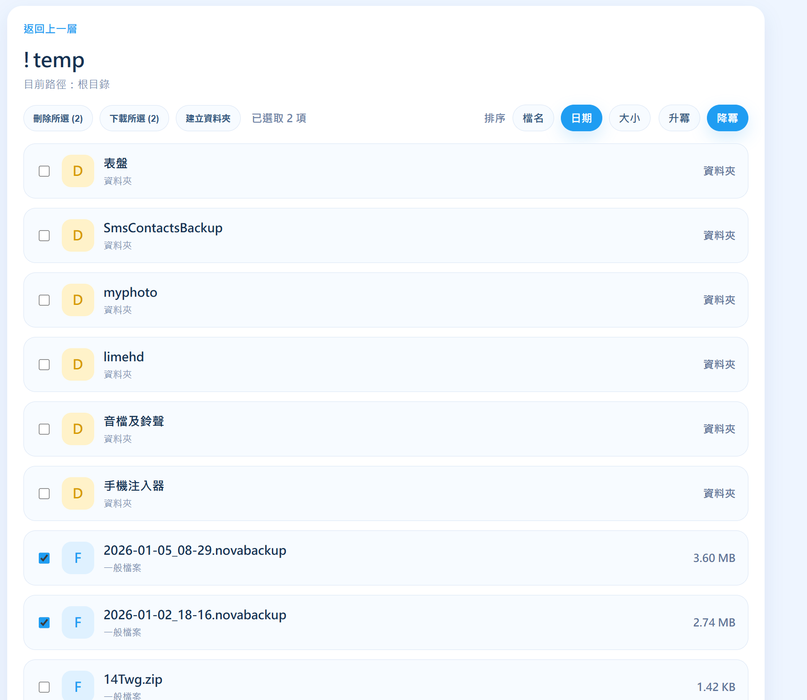

### Image Preview

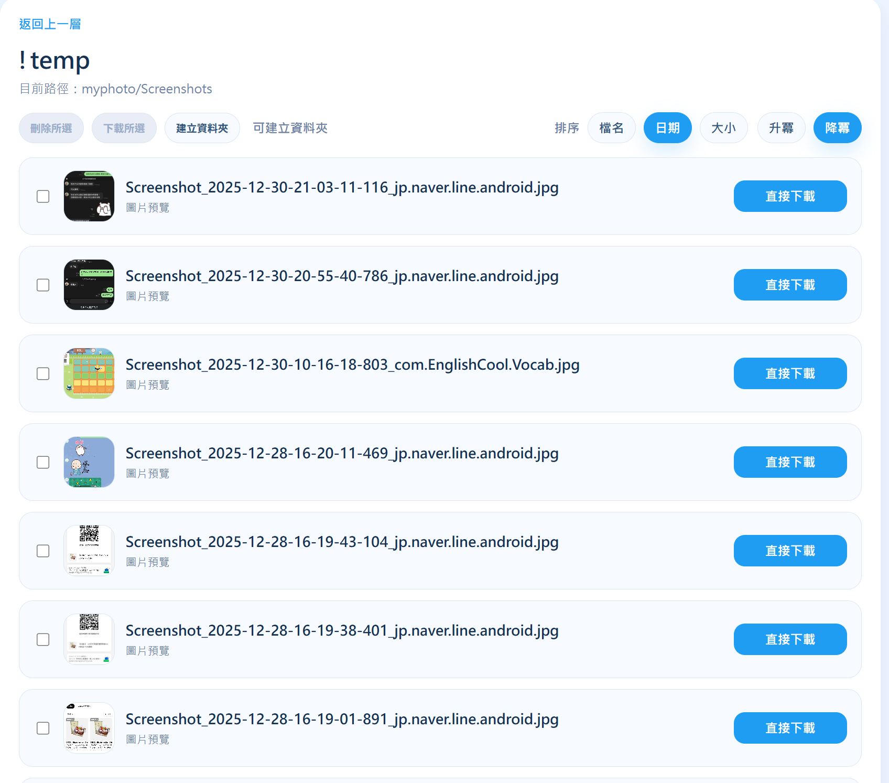

### Video Player

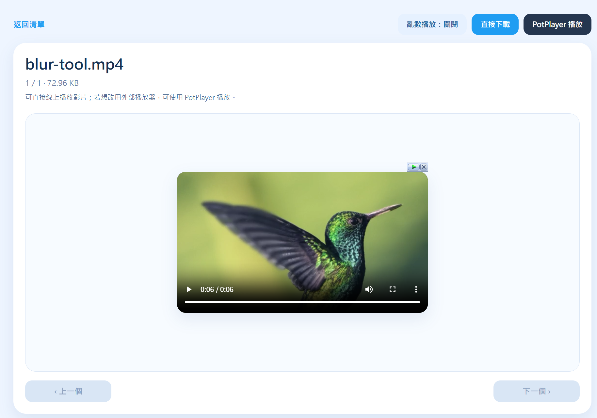

## Media Streaming

The browser interface supports online media playback.

Supported features include:

* HTML5 video playback
* HTML5 audio playback
* Music playlist
* Shuffle playback
* Quick track switching
* HTTP Range requests
* Video seeking
* Automatic subtitle loading
* PotPlayer launch support on Windows
* Automatic same-folder subtitle loading with PotPlayer
* Image preview and slideshow-style browsing

## Cloudflare Tunnel

Easy Cloud HFS supports two Cloudflare Tunnel modes for external access.

### Quick Tunnel

Quick Tunnel is the easiest option when you only need a temporary public link.

* No permanent domain is required.
* Easy Cloud HFS can automatically obtain a temporary `trycloudflare.com` public URL.
* The public URL may change after restarting the server or tunnel.

### Named Tunnel

Named Tunnel is intended for users who already have a Cloudflare-managed Tunnel and want to use their own permanent hostname.

* Configure your permanent public URL in Easy Cloud HFS.
* Configure the corresponding Cloudflare Tunnel Token.
* The Token is protected with Windows DPAPI when saved.
* The Token is passed to `cloudflared` through the `TUNNEL_TOKEN` environment variable.
* When connected, Easy Cloud HFS uses the configured permanent public URL directly.

Cloudflare Tunnel can provide external access without requiring:

* A public IP address
* Router port forwarding
* DDNS configuration
* Manual firewall changes

> [!NOTE]
> A **Quick Tunnel** URL is temporary and may change after restarting the server or tunnel.  
> A **Named Tunnel** can use your own permanent Cloudflare hostname when correctly configured.

## Permissions and Security

Each shared item can have its own permissions.

You can decide whether visitors are allowed to:

* Upload files
* Delete files
* Create folders
* Use browser chat
* Access password-protected content

Password-protected pages include a logout option so authorization can be cleared after use.

Cloudflare Named Tunnel Tokens are protected with Windows DPAPI before being stored by Easy Cloud HFS.

> [!WARNING]
> When external access is enabled, only share the public URL with people you trust. Do not expose private or sensitive files without appropriate protection.

## Portable Use

Easy Cloud HFS is designed as a portable Windows application.

Download the executable and run it directly without installation. Settings and required runtime data may be created beside the executable depending on the enabled features.

Typical release files:

```text
EasyCloudHFS.exe
EasyCloudHFS.exe_sha256.txt
```

## Download

Download the latest Windows release here:

[Download Easy Cloud HFS](https://github.com/Terence0816/easy-cloud-hfs/releases/latest)

Please download only from the official GitHub Releases page.

## SHA-256 Verification

Each release includes a SHA-256 verification file:

```text
EasyCloudHFS.exe_sha256.txt
```

On Windows PowerShell, you can calculate the executable hash with:

```powershell
Get-FileHash .\EasyCloudHFS.exe -Algorithm SHA256
```

Compare the result with the value inside `EasyCloudHFS.exe_sha256.txt`.

## Source Code Status

Starting with **v2.0.0.0**, the current application source code is no longer published or updated in this repository.

The source code already present in the repository:

* Belongs to an earlier legacy version
* Is retained for reference and study
* Does not represent the architecture or complete implementation of the current v2 release
* Should not be expected to build the current release executable
* Will not receive updates that track future compiled releases

For the current program, please use the executable provided on the official Releases page.

## Notes

* This repository is the official project page for the Windows version of Easy Cloud HFS.
* Current releases are provided as compiled Windows executables.
* Some operations may require running the application as Administrator.
* Windows Defender SmartScreen or antivirus software may warn about a newly released executable.
* Test the program in your own environment before using it for long-term or public sharing.
* Quick Tunnel public URLs are temporary.
* Named Tunnel supports a permanent Cloudflare hostname when properly configured.
* Only share files that you own or are authorized to distribute.

## Legacy Source License

The legacy source files retained in this repository are source-available for personal, educational, research, and internal non-commercial use only.

You may view, study, and modify those legacy source files for the permitted purposes above.

Without written permission from the author, you may not:

* Use the source code in commercial products
* Use the source code in paid services
* Sell the software or modified versions
* Redistribute rebranded versions as your own product
* Remove or hide the original author information
* Use the project name, icon, or branding for commercial distribution

Commercial use of the legacy source code requires written permission from the author.

> This legacy source license does not mean that the current v2 source code is included in this repository.

## Disclaimer

This software is provided as-is.

The author does not guarantee full compatibility with every Windows environment, network environment, browser, media player, or security product.

Use this tool only for files that you own or have permission to share.

---

# 繁體中文

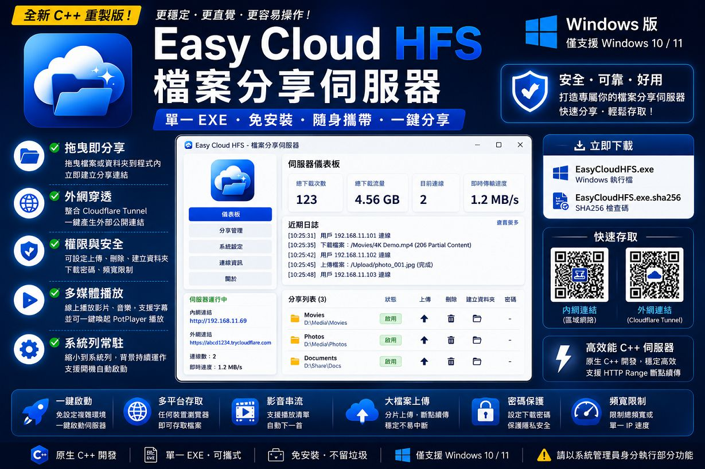

Easy Cloud HFS 是一套輕量化的 **Windows HTTP 檔案分享伺服器**。

它可以將 Windows 電腦變成簡易檔案分享伺服器，讓其他裝置透過瀏覽器瀏覽、下載、上傳、預覽及管理分享檔案。除了區域網路分享，也可透過 Cloudflare Tunnel 提供外部連線，支援 Quick Tunnel 臨時網址與 Named Tunnel 固定網域兩種模式。

目前的 v2 版本已改用精簡的原生 C++ 全面重建，不再依賴 Qt 執行環境。

> [!IMPORTANT]
> **原始碼狀態：自 v2.0.0.0 起，目前程式的原始碼不再於此儲存庫公開或持續更新。**  
> 儲存庫內目前保留的原始碼僅供舊版參考，並不對應現在的 v2 版本。  
> 最新版本將透過 GitHub Releases 頁面提供編譯完成的 Windows 執行檔。

## 最新版本 — v2.0.5

Easy Cloud HFS v2.0.5 包含 v2.0.1 之後的功能更新，主要新增 Cloudflare 固定網域支援、改善外部連線設定，並加入聊天室訊息提示功能。

### v2.0.5 主要更新

#### Cloudflare Quick Tunnel 與 Named Tunnel

* 新增 **固定網域（Named Tunnel）** 模式，可使用自己的 Cloudflare 固定網域。
* 原有 **臨時連結（Quick Tunnel）** 完整保留，可快速產生臨時 `trycloudflare.com` 公開網址。
* 系統設定新增：
  * 外部連線模式
  * 固定公開網址
  * Cloudflare Tunnel Token
* Tunnel Token 使用 **Windows DPAPI** 加密保護，不會以明碼保存。
* 啟動 `cloudflared` 時透過 `TUNNEL_TOKEN` 環境變數傳入 Token，不會將 Token 放入程序命令列。
* 使用 Named Tunnel 時會直接使用設定的固定公開網址，不再產生臨時短網址。

#### 外部連線設定改善

* 選擇 **Quick Tunnel** 時，原本保存的固定公開網址與 Tunnel Token 會繼續保留，但欄位會變成灰色並禁止修改。
* 切換回 **Named Tunnel** 後，相關欄位會立即恢復可編輯。
* 切換模式不會清除原本儲存的固定網址與加密 Token。
* 外部連線模式必須按下 **「儲存設定」** 後才會正式套用，避免誤操作。

#### 聊天室訊息提示

* 主控端左側 **「聊天室」** 新增訊息數字提示。
* 網頁右上角 **「聊天室」** 按鈕新增未讀訊息數字。
* 開啟聊天室頁面後，現有訊息會立即視為已讀並清除未讀數。
* 同一瀏覽器若已有聊天室分頁保持開啟，其他檔案瀏覽分頁不會持續累積未讀數。
* 有新留言時，其他頁面的聊天室按鈕會短暫閃動提示。
* 聊天室頁面本身不會閃動，避免閱讀時受到干擾。
* 不同瀏覽器分頁之間會同步聊天室已讀狀態。

### v2.0.1 聊天室改善

* 每一則聊天室留言新增 **獨立複製按鈕**。
  * 只複製留言文字。
  * 不會包含訪客名稱、時間與 IP 位址。
* 改善聊天室捲動行為。
  * 往上查看舊留言時，即使有新留言進來，也不會再被強制拉回最下方。
  * 如果原本已停留在聊天室最下方，新留言仍會自動顯示。
  * 自己送出新留言後，畫面會回到最新留言。
* 改善聊天室訊息更新方式，長篇貼文與大量文字內容的閱讀及複製更加順暢。

## 功能特色

* 輕量化 Windows HTTP 檔案分享伺服器
* 原生 C++ 桌面程式
* 精簡單一 EXE 可攜式設計
* 無需安裝，直接執行
* 不依賴 Qt 執行環境
* 區域網路檔案分享
* 可選擇啟用 Cloudflare Tunnel 外部連結
* **Quick Tunnel** 臨時 `trycloudflare.com` 公開網址
* **Named Tunnel** 自訂 Cloudflare 固定網域
* Cloudflare Tunnel Token 使用 Windows DPAPI 加密保護
* 支援拖曳檔案或資料夾快速建立分享
* 支援分享檔案、資料夾與虛擬資料夾
* 可修改分享資料夾的顯示名稱，不影響實際本機路徑
* 分享頁面可選擇啟用網頁聊天室
* 可個別控制是否啟用聊天室
* 主控端聊天室訊息數字提示
* 網頁聊天室未讀訊息提示與分頁已讀狀態同步
* 每則聊天室留言可獨立複製
* 改善查看聊天室歷史訊息時的捲動行為
* 可控制是否允許上傳
* 可控制是否允許刪除
* 可控制是否允許建立資料夾
* 支援密碼保護存取
* 密碼保護頁面支援登出
* 支援 HTTP Range Request，方便續傳與影音拖曳播放
* 支援大檔案上傳
* 支援將分享資料夾打包為 ZIP 下載
* 內建網頁端檔案管理介面
* 網頁端支援繁體中文與 English 切換
* 支援瀏覽器拖曳上傳檔案與資料夾
* 支援一次上傳多個檔案及多個資料夾
* 支援線上影片與音樂播放
* 音樂播放器支援播放清單與隨機播放
* 支援字幕自動載入
* 支援 Windows 端 PotPlayer 喚起播放
* 支援圖片預覽與投影片瀏覽
* 支援多檔案選取
* 即時儀表板
* 顯示目前檔案下載與打包進度
* 伺服器運作記錄
* 可縮小到系統列背景執行
* 可設定 Windows 開機自動啟動
* 可設定啟動程式時自動啟用伺服器
* 支援自動檢查與安裝新版
* 改善高 DPI 及 2K／4K 螢幕顯示
* 支援 Windows 10 / 11
* Windows 7 可使用主要程式功能

## 適用情境

* 從 Windows 電腦分享檔案給同一區域網路內的其他裝置
* 將電腦當成臨時小型檔案伺服器
* 透過瀏覽器分享檔案給朋友、客戶或同事
* 接收端不需安裝任何客戶端程式即可傳輸檔案
* 透過 Cloudflare Quick Tunnel 建立臨時外部公開網址
* 透過 Cloudflare Named Tunnel 使用自己的固定公開網域
* 直接從 Windows 電腦串流影片或音樂
* 將桌機或筆電當成輕量化私人雲端硬碟
* 分享檔案時透過網頁聊天室進行簡單溝通

## 使用方式

1. 下載並啟動 `EasyCloudHFS.exe`。
2. 在「分享管理」中新增檔案或資料夾。
3. 從其他裝置的瀏覽器開啟程式顯示的區域網路網址。
4. 依需求設定上傳、刪除、建立資料夾、聊天室與密碼權限。
5. 視需要啟用 Cloudflare 外部連線：
   * 使用 **Quick Tunnel** 取得臨時公開網址。
   * 已設定 Cloudflare Tunnel 時，可使用 **Named Tunnel** 搭配自己的固定網域。

## 介面介紹

### 分享管理

程式啟動後會直接進入「分享管理」，方便快速新增及管理分享項目。

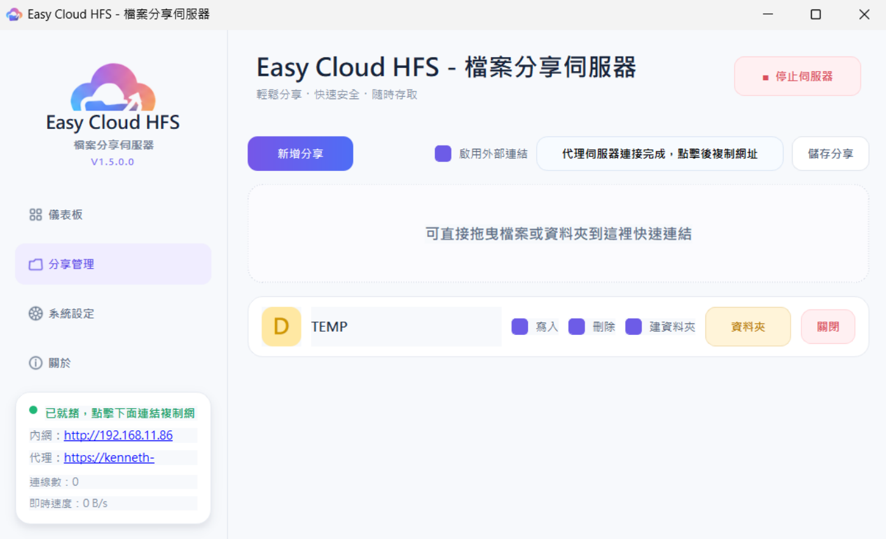

支援設定：

* 啟用或停用分享
* 修改分享顯示名稱
* 啟用或停用網頁聊天室
* 允許上傳
* 允許刪除
* 允許建立資料夾
* 設定密碼保護

### 儀表板

儀表板會顯示伺服器狀態與即時統計資料。

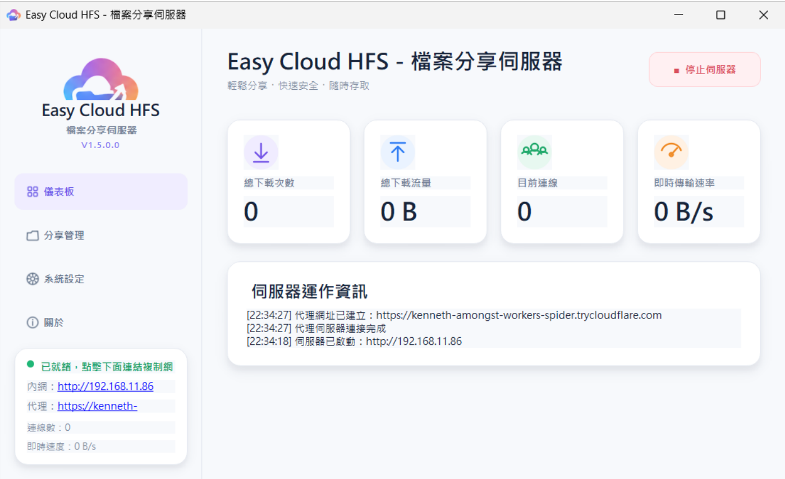

可顯示：

* 總下載次數
* 總傳輸流量
* 目前連線數
* 即時傳輸速度
* 目前檔案下載及打包進度
* 近期伺服器活動
* 區域網路網址
* Cloudflare Tunnel 外部網址

### 系統設定

設定頁面可調整伺服器、程式與外部連線行為。

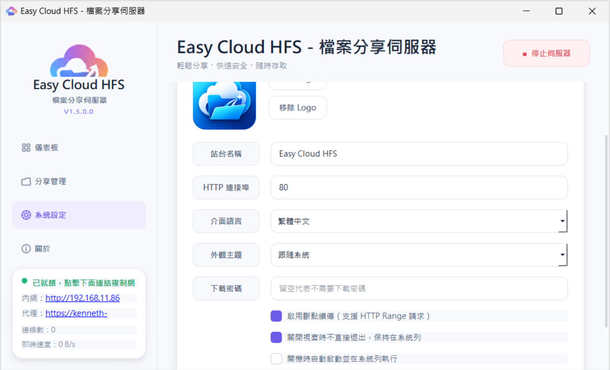

可設定項目包含：

* 站台名稱
* HTTP 連接埠
* 介面語言
* 外觀主題
* 下載密碼
* HTTP Range／斷點續傳
* 縮小到系統列
* Windows 開機自動啟動
* 啟動程式時自動啟用伺服器
* Cloudflare 外部連線模式
* Named Tunnel 固定公開網址
* Cloudflare Tunnel Token

## 網頁端介面

使用者可透過一般瀏覽器存取分享檔案。

網頁端支援：

* 瀏覽檔案與資料夾
* 直接下載檔案
* 將資料夾打包為 ZIP 下載
* 權限允許時上傳檔案及資料夾
* 透過瀏覽器拖曳上傳
* 多檔案選取
* 繁體中文與 English 切換
* 選用網頁聊天室
* 聊天室未讀訊息提示
* 單則留言複製
* 圖片預覽
* 音樂及影片播放
* 字幕自動載入

### 網頁聊天室

分享頁面可依需求啟用輕量化網頁聊天室。

目前版本已加入聊天室未讀提示、歷史訊息閱讀捲動改善、不同分頁已讀狀態同步，以及單則留言一鍵複製功能。


### 多檔案選取


### 圖片預覽


### 影片播放器


## 影音串流

網頁端支援線上影音播放。

支援功能包含：

* HTML5 影片播放
* HTML5 音訊播放
* 音樂播放清單
* 隨機播放
* 歌曲快速切換
* HTTP Range Request
* 影片拖曳播放
* 字幕自動載入
* Windows 端 PotPlayer 喚起播放
* PotPlayer 自動載入同目錄字幕
* 圖片預覽與投影片瀏覽

## Cloudflare Tunnel 外部連結

Easy Cloud HFS 支援兩種 Cloudflare Tunnel 外部連線模式。

### Quick Tunnel 臨時連結

Quick Tunnel 適合需要快速產生臨時公開網址的情況。

* 不需要固定公開網域。
* Easy Cloud HFS 可自動取得臨時 `trycloudflare.com` 公開網址。
* 重新啟動伺服器或 Tunnel 後，公開網址可能會改變。

### Named Tunnel 固定網域

Named Tunnel 適合已在 Cloudflare 建立 Tunnel，並希望使用自己固定 Hostname 的使用者。

* 可在 Easy Cloud HFS 設定固定公開網址。
* 可設定對應的 Cloudflare Tunnel Token。
* Token 儲存時會使用 Windows DPAPI 加密保護。
* 啟動 `cloudflared` 時透過 `TUNNEL_TOKEN` 環境變數傳入 Token。
* 連線成功後直接使用設定的固定公開網址。

Cloudflare Tunnel 可讓外部裝置連入，而不需要：

* 公網 IP
* 路由器 Port Forwarding
* DDNS 設定
* 手動調整防火牆

> [!NOTE]
> **Quick Tunnel** 產生的是臨時網址，重新啟動伺服器或 Tunnel 後可能會變更。  
> **Named Tunnel** 正確設定後可使用自己的 Cloudflare 固定網域。

## 權限與安全

每個分享項目都可以個別設定權限。

可自行決定是否允許使用者：

* 上傳檔案
* 刪除檔案
* 建立資料夾
* 使用網頁聊天室
* 透過密碼存取受保護內容

密碼保護頁面提供登出功能，使用完畢後可清除目前的登入授權。

Cloudflare Named Tunnel 的 Token 在 Easy Cloud HFS 儲存前會使用 Windows DPAPI 加密保護。

> [!WARNING]
> 啟用外部連結時，請只將公開網址提供給可信任的對象。未妥善設定保護前，請勿公開私人或敏感檔案。

## 可攜式使用

Easy Cloud HFS 採用可攜式 Windows 程式設計。

下載執行檔後即可直接使用，無需安裝。依照啟用的功能，設定與必要執行資料可能會建立在主程式旁。

一般 Release 檔案包含：

```text
EasyCloudHFS.exe
EasyCloudHFS.exe_sha256.txt
```

## 下載

請從官方 GitHub Releases 頁面下載最新 Windows 版本：

[下載 Easy Cloud HFS](https://github.com/Terence0816/easy-cloud-hfs/releases/latest)

請勿從不明第三方網站下載程式。

## SHA-256 驗證

每個版本皆會提供 SHA-256 驗證檔：

```text
EasyCloudHFS.exe_sha256.txt
```

可在 Windows PowerShell 執行：

```powershell
Get-FileHash .\EasyCloudHFS.exe -Algorithm SHA256
```

再將計算結果與 `EasyCloudHFS.exe_sha256.txt` 內的數值比對。

## 原始碼狀態

自 **v2.0.0.0** 起，目前程式的原始碼不再於此儲存庫公開或持續更新。

儲存庫內已存在的原始碼：

* 屬於較早期的舊版本
* 僅保留供參考與研究
* 不代表目前 v2 版本的架構或完整實作
* 無法視為可編譯出目前版本執行檔的對應原始碼
* 後續不會跟隨新版執行檔持續更新

需要使用目前版本時，請直接下載官方 Releases 頁面提供的執行檔。

## 注意事項

* 本儲存庫是 Easy Cloud HFS Windows 版本的官方專案頁面。
* 最新版本以編譯完成的 Windows 執行檔形式提供。
* 部分操作可能需要使用系統管理員身分執行。
* Windows Defender SmartScreen 或防毒軟體可能會對新發行的執行檔顯示提醒。
* 建議正式長時間或公開分享前，先在自己的環境測試。
* Quick Tunnel 產生的公開網址為臨時網址。
* Named Tunnel 正確設定後可使用固定 Cloudflare 網域。
* 請只分享您擁有或已取得散布授權的檔案。

## 舊版原始碼授權

本儲存庫內保留的舊版原始碼，僅供個人、學習、研究與內部非商業用途使用。

您可以基於上述允許用途，檢視、研究及修改這些舊版原始碼。

未經作者書面同意，不得：

* 將原始碼用於商業產品
* 將原始碼用於付費服務
* 轉售本軟體或修改版本
* 改名後重新發佈為自己的產品
* 移除或隱藏原作者資訊
* 使用本專案名稱、圖示或品牌進行商業散布

舊版原始碼的商業用途需取得作者書面同意。

> 此舊版原始碼授權不代表本儲存庫包含目前 v2 版本的原始碼。

## 免責聲明

本軟體依現況提供。

作者不保證所有 Windows 環境、網路環境、瀏覽器、播放器或安全性軟體皆能完整相容。

請僅使用本工具分享您擁有或已取得授權的檔案。
